# SeeSo Sample iOS

### Index
- [App Introduction](#App-Introduction)
- [Requirements](#Requirements)
- [How to run](#How-to-run)
- [Function description of the app](#Function-description-of-the-app)

## App Introduction

 This app is designed to help you understand how GazeTracker works. This is because the functions available for each state are activated.

## Requirements

- SeeSo.framework : 2.4.0
- Swift: 5.4
- It must be run on a **real iOS device. (iOS 11.0 +, iPhone 6s +)**
- It must be an **internet environment.**

## How to run

1. Clone or download this project.
2. Add SeeSo.framework to the project as shown below. (At this time, "copy items if needed" should be checked.)

    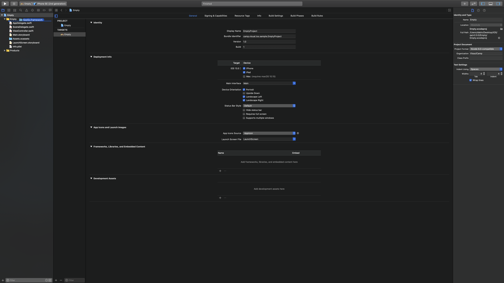

    2-1 

    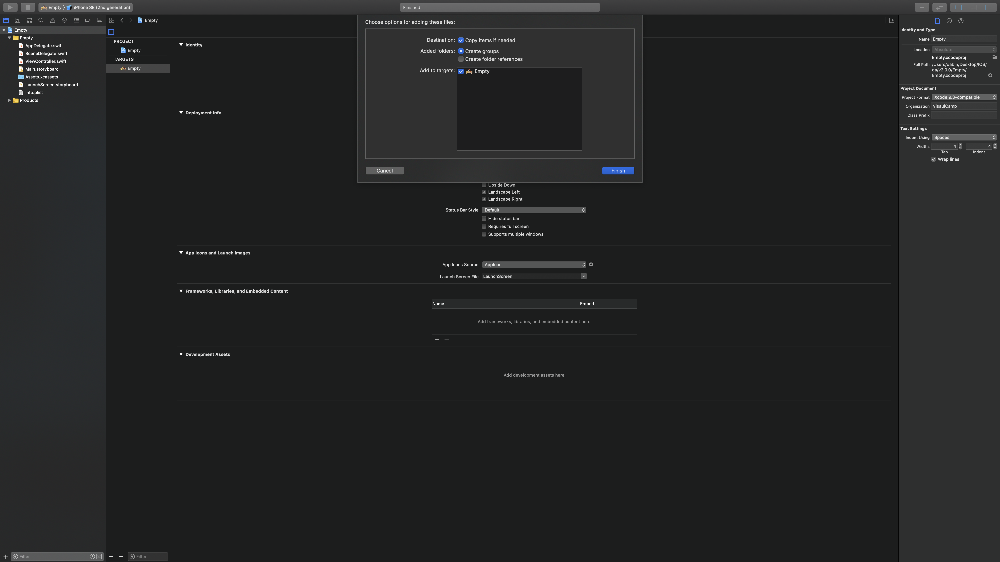

    2-2

    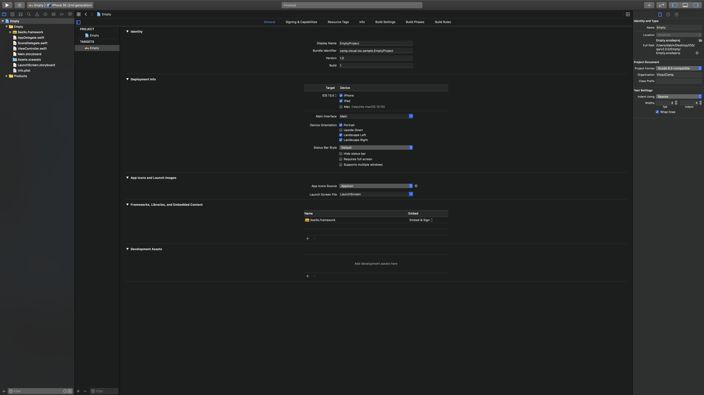

    2-3

3. Now change the SeeSo.framework to sign & embed as shown below.

    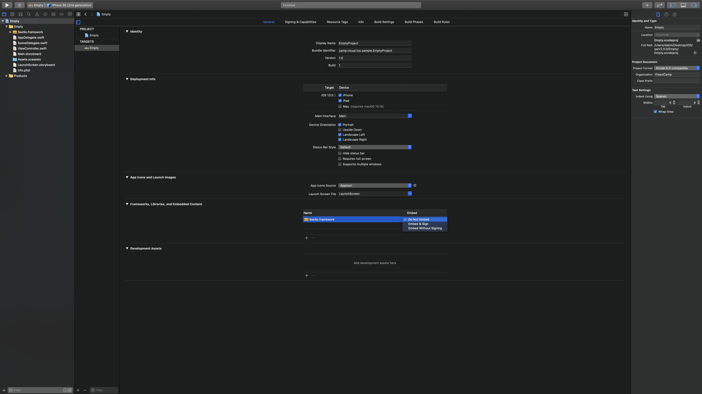

    3-1

4. Sign in with your developer ID in the Signing & Capabilities tab.
5. Insert your own development key in the licenseKey into the "ViewController.swift".

    

    5-1

6. Allow camera access.

    

## Function description of the app

1. Click on the switch to activate it.
When creating a gaze tracker, the userStatus function is used.

    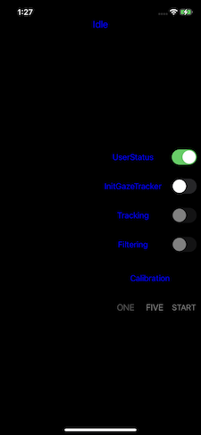

    1-1. Using UserStatus

    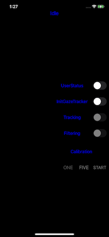

    1-1. Not using UserStatus

2. Click on the switch to activate it. SeeSo.framework's GazeTracker
To create. Deactivation again destroys the object. After creation, the userStatus switch cannot be used.

    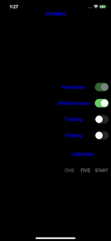

    1-1. GazeTracker init.

    

    1-2. GazeTracker deinit

3. Clicking the switch to activate activates eye tracking. If the UserStatus switch is turned on, the UI related to UserStatus is displayed. if turned off, only the preview and GazePoint are displayed.

    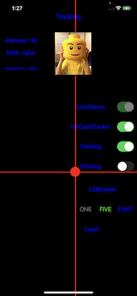

    2-1. UserStatus ON

    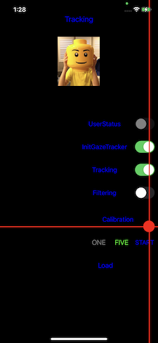

    2-2. UserStatus OFF

4. Click the switch to activate it, and GazePointView uses the OneEuroFilterManager coordinates. If disabled again, the OnGaze's GazeInfo coordinates are used.

    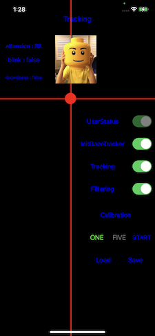

    4-1. Filtered x,y

5. The One Five button can only select one of the two. When selected, the color changes to green, meaning one-point calibration and five-point calibration, respectively. Click the start button next to start calibration.

    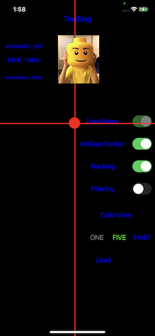

    5-1. Five point calibration mode.

    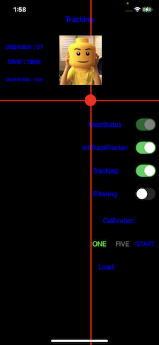

    5-2 One point calibration mode.

6. The top label tells you the status of each. If an error occurs, see the api documentation and deal with it.
7. The camera preview is visible when it is in eye tracking.
8. When calibration is complete, the save button at the bottom right appears. Click this button to save the calibration information.

    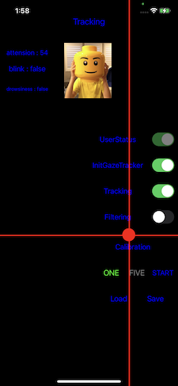

    8-1 After calibration is complete, the save button is activated.

    

    8-2 When you click the save button, the label at the top changes to "Saved calibration datas", and the save button disappears.

9. When in tracking state, if there is calibration data stored in the app, the load button is activated. If you click the load button, the eye tracking will proceed with the saved calibration state.

    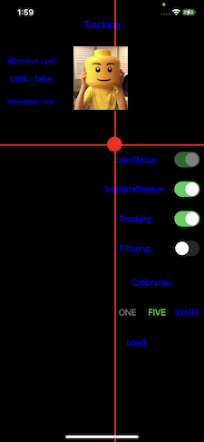

    9-1 Activation of the load button when tracking status and calibration data is stored in the app.

    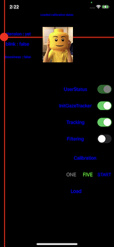

    9-2 When the load button is clicked, the label at the top changes to "Loaded calibration datas" and the eye tracking with previous calibration data applied starts.

10. It cannot be loaded when in Calibrating state. Please be aware of this.
